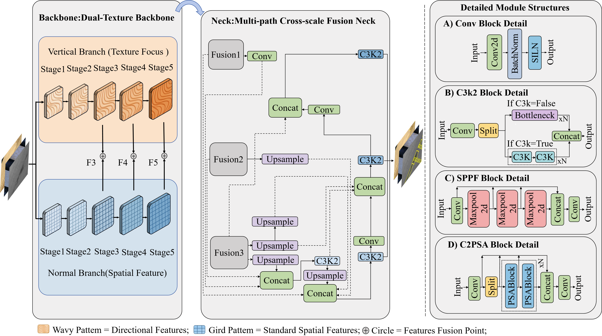

# DSDNet-A-Direction-Sensitive-Dual-Branch-Detection-Network-for-Industrial-Surface-Defect-Detection

> This repository currently contains materials related to our ongoing work. We are organizing the relevant files, and more detailed code will be released once this process is complete.

## Network Architecture

  

> The main contributions of this paper are summarized as follows:

1. A direction-sensitive dual-branch framework is proposed for multi-material industrial surface defect detection. The framework jointly models directional texture information and conventional semantic information, alleviating the representation mismatch of mainstream methods in multi-material scenarios from the perspective of representation learning.

2. A directional texture modeling mechanism comprising DirectionalConv and CDFA is developed. DirectionalConv introduces a local directional inductive bias through sequential dense spatial decomposition along orthogonal axes while preserving interactions across channels. CDFA complements this operation by retaining and aggregating directional responses from multiple intermediate stages, thereby limiting the progressive attenuation of subtle defect cues during hierarchical feature propagation.

3. A dual-branch fusion strategy and the MCF Neck are constructed to enhance cross-scale collaborative representation between shallow texture details and deep semantic context. In detail, MCF improves the utilization efficiency of complementary dual-branch features during the detection stage, enhancing detection performance under complex backgrounds and multi-scale defect scenarios.
